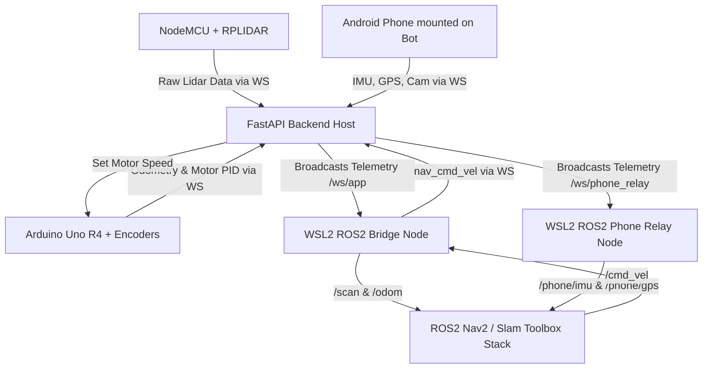

# SLAM Bot: All-in-One System Architecture

This document describes how the SLAM Bot software stack functions in the backend, how ROS2 handles sensor feeds, how the Extended Kalman Filter (EKF) integrates phone sensors with wheel encoders, and how the AI voice assistant commands the bot.

---

## 1. Data Flow & Communication Routing

The architecture uses a hub-and-spoke model centered around a **FastAPI WebSocket Backend** running on the host system.



### Protocol Layers
1. **Device WebSockets**:
   - `/ws/motion` (Arduino Uno R4): Sends ticks/odometry, receives linear/angular speeds.
   - `/ws/lidar` (NodeMCU): Streams raw angle-distance pairs from the RPLIDAR A1.
   - `/ws/phone`: Streams real-time IMU, GPS, and JPEG camera frames.
2. **ROS2 Bridge Clients**:
   - `bridge_node.py` (WSL2): Connects to `/ws/app` to convert JSON feeds into `sensor_msgs/LaserScan` and `nav_msgs/Odometry` messages.
   - `phone_relay.py` (WSL2): Connects to `/ws/phone_relay` to unpack phone IMU (`sensor_msgs/Imu`), GPS (`sensor_msgs/NavSatFix`), and compressed frames (`sensor_msgs/CompressedImage`).

---

## 2. ROS2 Processing Pipeline

ROS2 (Robot Operating System 2 Humble) operates on nodes passing messages via publisher/subscriber patterns:

1. **LaserScan Processing**:
   - The raw scan returns from RPLIDAR are irregular (variable angles).
   - The `bridge_node` bins these returns into 360 fixed-width sectors (1 degree each).
   - **Mirrored coordinate correction**: Handedness correction is performed inside `scan_to_ranges` by mapping `(360 - angle) % 360` to align scan orientation with REP-103 standards.
2. **Occupancy Grid Mapping**:
   - `slam_toolbox` subscribes to `/scan` and `/tf` (transformations).
   - It performs scan matching (comparing new scans with previous ones) to determine fine positional updates, drawing a probability grid (occupancy grid map) published on `/map`.
3. **Autonomy (Nav2)**:
   - User navigates by clicking a point on the map.
   - The frontend transmits the goal coordinate to `bridge_node`, which issues it to Nav2's `navigate_to_pose` action server.
   - Nav2 uses costmaps (global/local obstacles) and a DWA controller to compute optimal motor velocities, publishing twist messages to `/cmd_vel`.

---

## 3. Sensor Fusion via Extended Kalman Filter (EKF)

Wheel encoders are highly accurate for short movements, but they drift due to wheel slippage and uneven floors. Smartphone IMUs have high-precision gyroscopes and accelerometers, but suffer from linear integration drift. Fusing them using an EKF eliminates both weaknesses.

### EKF Configuration (`ekf.yaml`)
We configure `robot_localization` to run inside WSL2:
* **Fuses Wheel Odometry (`odom`)**: Uses absolute positional updates $X, Y$ and orientation $\theta$ (yaw), alongside linear velocity $v_x$ and angular velocity $\omega_z$.
* **Fuses Phone IMU (`phone/imu`)**: Uses angular velocities (roll rate, pitch rate, yaw rate) to reject wheel-spin slip, and linear acceleration ($a_x, a_y$) to detect physical collisions or sudden inertia.
* **Outputs**: A smooth, drift-resistant navigation frame `/odom` -> `/base_link` that remains accurate even if wheels slide.

---

## 4. AI Voice Assistant Integration

The AI voice pipeline translates verbal commands into Nav2 goal targets:

```
[Phone Mic Audio] ──> [FastAPI Backend] ──> [Whisper Speech-To-Text]
                                                     │
                                                     ▼
                                            [LLM Intent Parser]
                                                     │
                                                     ▼
[Goal Pose (x, y)] <── [Resolve Coordinates] <── [Spatial Mapping]
         │
         ▼
[Nav2 action server] ──> [Bot Drives to Room]
```

1. **Microphone Capture**: The phone captures speech audio and streams it to the `/ws/phone` endpoint.
2. **Whisper Transcription**: The backend processes audio using OpenAI Whisper to yield clean text.
3. **Intent Parsing & Spatial Database**: 
   - An LLM (e.g., Ollama/llama3 or Gemini API) parses the command (e.g., *"Go to the kitchen and scan the room"*).
   - The intent matches a known landmark database (e.g., `kitchen` = $x: 2.5, y: -1.2, \theta: 0.0$).
4. **Command Execution**: The backend fires the coordinate target down to the ROS2 bridge, triggering Nav2 to steer the bot.

---

## 5. Electron Wrapper Startup Sequencing

On startup, the Electron Desktop Wrapper handles the launch cascade automatically:

1. **Phase 1: Windows Backend**: Spawns the FastAPI host which binds to port 8000 and begins listening for device WebSocket attempts.
2. **Phase 2: WSL2 Workspace Bringup**: Electron executes a shell command:
   ```bash
   wsl.exe -e bash -c "source /opt/ros/humble/setup.bash && source install/setup.bash && ros2 launch slam_bot_bringup bringup.launch.py"
   ```
3. **Phase 3: GUI Load**: Loads `http://localhost:5173/dashboard` in the Chromium frame. On window close, Electron cleans up the process tree.
